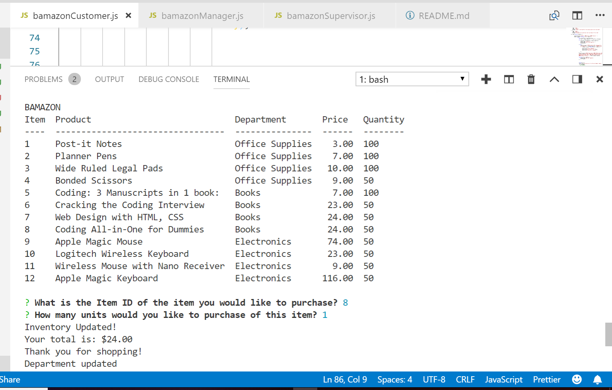
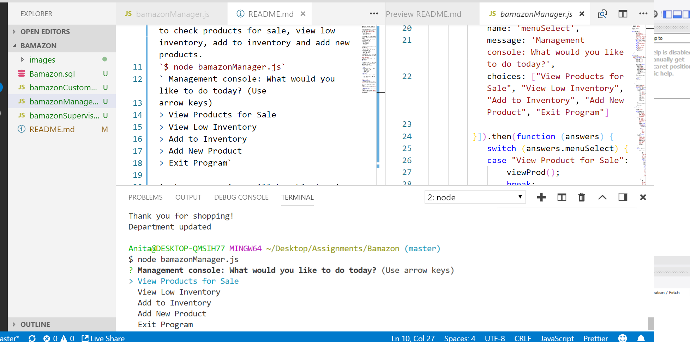
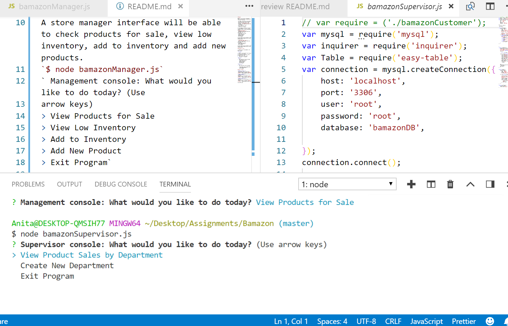

# Bamazon

Bamazon is a storefront like app. It uses two tables within a database and three user interfaces.

 A customer interface will be prompted with items to buy from the stores inventory and the total for their purchase. `$ node bamazonCustomer.js` `Customer console:What would you like to purchase?
> Lists Products for Sale
> Your total is:$
> Thank you for shopping

A store manager interface will be able to check products for sale, view low inventory, add to inventory and add new products.
`$ node bamazonManager.js`
` Management console: What would you like to do today? (Use
arrow keys)
> View Products for Sale
> View Low Inventory
> Add to Inventory
> Add New Product
> Exit Program`

A store supervisor will be able to view product sales by department and create new departments.

`$ node bamazonSupervisor.js`
` Supervisor console: What would you like to do today? (Use
arrow keys)
> View Products for Sale
> Add new departments
> Exit Program`

A store supervisor will be able to view product sales by department and create new departments.

## How does it work

1. Questions will be prompted in the Bash Terminal:

**Customer**:

1. 'What is the Item ID of the item you would like to purchase?'
2. 'How many units would you like to purchase of this item?'
3. 'Your total is: $' + total.
4. 'Thank you for shopping!'

**Manager**:

1. 'What would you like to do today?'
   > View Product for Sale
   > View Low Inventory
    >Add to Inventory
   > Add New Product
   > Exit Program

**Supervisor**:

1. 'What would you like to do today?'

   > View Product Sales by Department
   > Create New Department
   > Exit Program

## How it worked

***Bamazon Customer:***  
(The customer interface works well.)
![bamazonCustomer screenshot]

***Bamazon Manager:***  
(The Manager Interface does not fully connect.)
![bamazonManagerscreenshot]

***Bamazon Supervisor:***  
(The supervisor interface does not fully connect.)
![bamazonSupervisor screenshot]

Anita McFarland